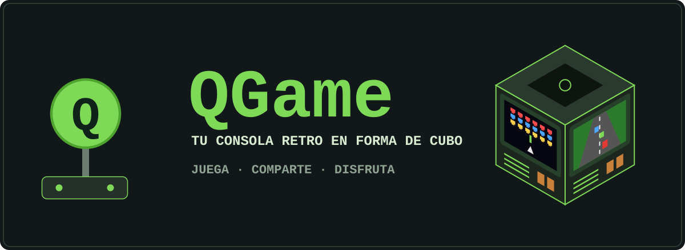
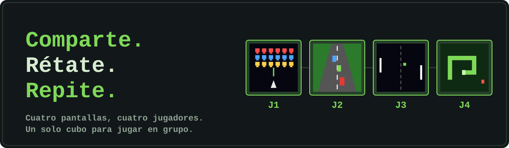
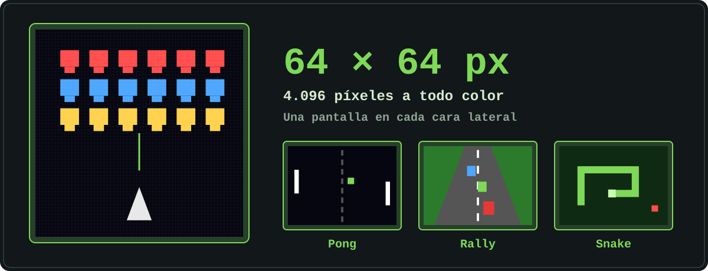
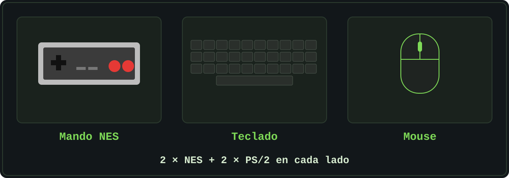
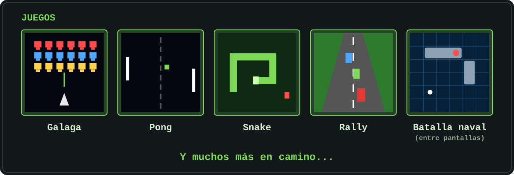
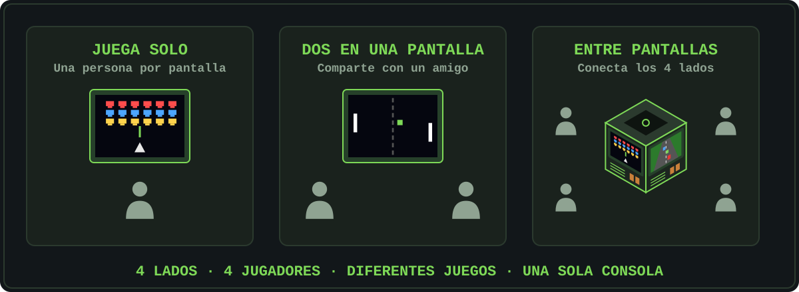

<div align="center">



# QGame
### Tus juegos de siempre, con un nuevo reto!

**Juega · Comparte · Disfruta**

</div>

---

## ¿Qué es QGame?

QGame es una consola de videojuegos retro multijugador, pensada para **compartir y retarse**. Su diseño en forma de cubo pone una pantalla en cada una de sus cuatro caras laterales, para que cada lado sea una estación de juego donde todos puedan divertirsde alrededor del mismo equipo, ya sea compartiendo o poniendo a prueba sus habilidades.

Podras disfrutar de los clásicos de siempre, pero esta vez juegalos en compañía: contra un amigo en la misma pantalla o entre otras pantallas conectadas.



> **4 lados. hasta 8 jugadores. Diferentes juegos. Un espacio, ua sola consola.**

---

## Juega a full color en un espacio compacto

Cada estación tiene una pantalla a color de **64 × 64 píxeles**, con la estética clasica de píxel de los arcades clásicos. En total son **4 pantallas** independientes, Inicia las pantallas y los juegos que quieras, en el momento que qieras.



<!-- Tenems que reemplazar las imagenes de IA por capturas reales de los juegos en las pantallas del tipo que vamos a usar -->

---

## Experimenta el juego de la manera que quieras

QGame es compatible con distintos tipos de periféricos. 

Cada estación incluye:

- **2 conectores tipo NES**, para mandos NES.
- **2 conectores PS/2**, para teclado y mouse.

Así cada jugador elige cómo jugar a su maximo nivel.



---

## Juegos que podras revivir

| Juego | Descripción |
|---|---|
| **Galaga** | El clásico shooter espacial. |
| **Pong** | El duelo de paletas de toda la vida. |
| **Snake** | Crece sin chocar contigo mismo. |
| **Rally** | Esquiva el tráfico y llega lo más lejos posible. |
| **Batalla naval** | Pensado para interconexión entre pantallas. |

*Y muchos más en camino...*



<!-- Debemos agregar una captura por juego y confirmar cuáles quedan en modo multijugador -->

---

## Juega a tu manera

Un cubo, cuatro estciones, infinitas posibilidades:

- **Juega solo:** disfruta tus juegos favoritos en cualquier pantalla.
- **Dos en una pantalla:** comparte la emoción con un amigo en el mismo lado del cubo.
- **Entre pantallas:** conecta las 4 pantallas y vive la experiencia multijugador en un mismo juego.



---

## Especificaciones

| | |
|---|---|
| **Pantallas** | 4 pantallas a color, 64 × 64 px (una por cara lateral) |
| **Plataforma** | Placas FPGA |
| **Controles** | Mando NES, teclado y mouse |
| **Conectores por cara** | 2 × NES, 2 × PS/2 |
| **Audio** | Parlante integrado con rejilla en cada cara |
| **Encendido** | Botón general de la fuente (parte superior) y botón individual por pantalla |
| **Ventilación** | Rejilla en la parte superior |
| **Base** | Soportes de apoyo estables |
| **Chasis** | Impresión 3D |

---

## Desarrollo conceptual y técnico del producto


```
QGame- KUBIX/


```

<!-- Agregar: Diagrama de flujo general del proyecto, diagramas especificos de caseccion por asignacion de grupo, diagramas de bloques y de mas que consideremos   -->

---

## Equipo

Proyecto de **Electrónica Digital 1**, Ingeniería Eléctrica, Universidad Nacional de Colombia.

| Integrante | Rol |
|---|---|
| _Nombre_ | _Rol_ |
| _Nombre_ | _Rol_ |
| _Nombre_ | _Rol_ |
| _Nombre_ | _Rol_ |
